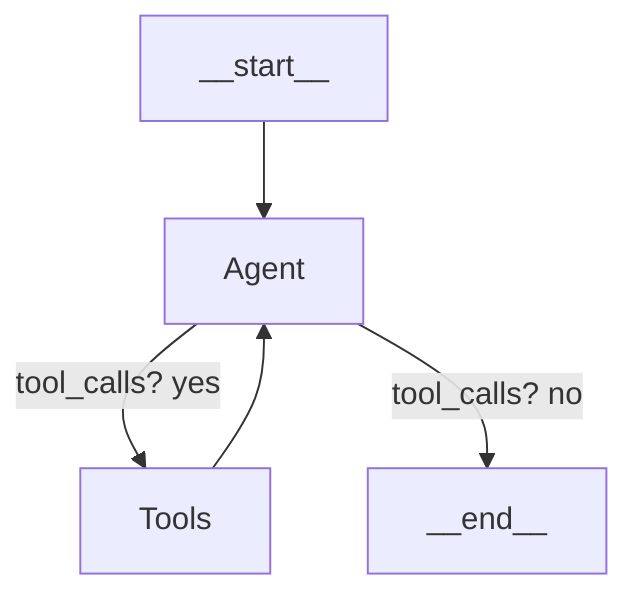

# LangGraph Alignment Plan – Chat Router Refactor

> **Objective** Bring the chat‑router flow fully in line with the reference LangGraph pattern (agent ➜ tools ➜ agent ➜ **end**), eliminate GraphRecursionError, add type‑safe state fields, and simplify maintenance.

---

## 1 Current Issues Recap

| Symptom                                            | Root Cause                                                                                                                           |
| -------------------------------------------------- | ------------------------------------------------------------------------------------------------------------------------------------ |
| `GraphRecursionError (limit 25 reached)`           | Router returns itself / stale `tool_calls` cause endless agent ↔ tools loop.                                                        |
| `property 'processed' does not exist` linter error | Ad‑hoc fields (`processed`, `intent`) missing in `OverallProposalState`; reducers drop them, so router believes message unprocessed. |
| Monolithic router node                             | Bundles **LLM reasoning**, **tool execution**, and **final reply** – diverges from LangGraph best‑practice.                          |

---

## 2 Target Architecture (💯 mirrors docs)



- **Agent node** – LLM bound to `interpretIntentTool` & chat prompt
- **Tool node** – single `ToolNode` wrapping `interpretIntentTool`
- **shouldContinue** – if last `AIMessage.tool_calls?.length > 0` route → "tools" else "**end**"

All _user‑facing_ replies are emitted by the **second** invocation of `Agent` **after** tool results are in state.

---

## 3 State & Annotation Updates

### 3.1 Interface

```ts
export interface OverallProposalState {
  …existing…
  messages: BaseMessage[];            // already present
  intent?: {
    command: "regenerate_section" | "modify_section" | "approve_section" | "ask_question" | "help" | "other";
    targetSection?: string;
    details?: string;
  };
}
```

### 3.2 Annotation

```ts
export const ProposalStateAnnotation = Annotation.Root({
  messages: Annotation<BaseMessage[]>({ reducer: messagesStateReducer }),
  intent: Annotation<OverallProposalState["intent"]>(),
});
```

No more `processed` flag – termination controlled by `shouldContinue`.

---

## 4 Tool Definition

```ts
// tools/interpretIntentTool.ts
export const interpretIntentTool = tool(
  async ({ userMessage }: { userMessage: string }) => {
    // no run‑time logic; LLM fills in output schema
    return "ok";
  },
  {
    name: "interpret_intent",
    description: "Infer the command the user wants to execute",
    schema: z.object({ userMessage: z.string() }),
    returnType: commandSchema, // zod object declared centrally
  }
);
```

> **Note:** use the built‑in LangChain `tool` helper, not `StructuredTool`, to be fully compatible with LangGraph prebuilt `ToolNode`.

---

## 5 Agent Node Implementation

```ts
async function agentNode(state: typeof ProposalStateAnnotation.State) {
  const messages = state.messages;
  const model = new ChatOpenAI({
    modelName: "gpt-4o-mini",
    temperature: 0,
  }).bindTools([interpretIntentTool]);

  const response = await model.invoke(messages);

  // If this response contains a tool call we just return it – will trigger Tools node
  // Otherwise, we may parse the tool result already stored in messages and craft a
  // user‑facing reply.

  let updates: Partial<typeof ProposalStateAnnotation.State> = {
    messages: [response],
  };

  if (!response.tool_calls?.length) {
    // tool step already completed; fetch last ToolMessage, update intent, craft reply
    const toolMsg = messages.findLast((m) => m instanceof ToolMessage) as
      | ToolMessage
      | undefined;
    if (toolMsg) {
      const parsed = safeJSON(toolMsg.content);
      updates.intent = {
        command: parsed.command,
        targetSection: parsed.target_section,
        details: parsed.request_details,
      };

      // build friendly reply prompt (no tools)
      const reply = await new ChatOpenAI({
        modelName: "gpt-4o-mini",
        temperature: 0.7,
      }).invoke([
        new SystemMessage("You are a helpful proposal assistant …"),
        ...messages,
      ]);
      updates.messages!.push(reply);
    }
  }

  return updates;
}
```

- `safeJSON` helper wraps `JSON.parse` with fallback.

---

## 6 Graph Construction

```ts
const graph = new StateGraph(ProposalStateAnnotation)
  .addNode("agent", agentNode)
  .addNode("tools", new ToolNode([interpretIntentTool]))
  .addEdge("__start__", "agent")
  .addConditionalEdges("agent", shouldContinue)
  .addEdge("tools", "agent");
```

```ts
function shouldContinue(state: typeof ProposalStateAnnotation.State) {
  const last = state.messages[state.messages.length - 1] as AIMessage;
  return last.tool_calls?.length ? "tools" : "__end__";
}
```

---

## 7 Chat Entry‑Point API Flow

1. API receives user text → converts to `HumanMessage`.
2. Invoke compiled graph with `{ messages: [humanMsg] }` & `thread_id`.
3. Graph returns updated state where **final** message is the friendly AI reply.
4. Orchestrator extracts `.messages.at(-1)` for UI.

No recursion risk because graph ends whenever agent emits plain text.

---

## 8 Testing Strategy

- **Unit tests** (Vitest)
  - `shouldContinue` – returns "tools" when tool_calls present, otherwise **end**.
  - `agentNode` – given tool result in state, updates `intent` correctly.
- **Integration** – mock `ChatOpenAI` to emit tool call then plain answer; assert flow `agent → tools → agent → __end__`.

---

## 9 Migration Steps & Roll‑out

1. **Add new state fields & annotation** – compile passes.
2. **Create interpretIntentTool** in `/tools/`.
3. **Implement agentNode, shouldContinue**.
4. **Refactor graph.ts** to new topology; remove current chatRouter.
5. **Adjust OrchestratorService** to use compiled graph entrypoint.
6. **Delete obsolete flags & duplicate logic**.
7. **Run tests + linter**.
8. **Deploy to staging**, monitor for:
   - Missing API keys ⇒ clear 401 error returned by OpenAI.
   - LLM returning invalid JSON ⇒ handle in `safeJSON` fallback.
   - Unexpected tool recursion ⇒ logs show >1 consecutive tool cycles.

---

## 10 Potential Pitfalls & Mitigations

| Risk                                         | Mitigation                                                                                        |
| -------------------------------------------- | ------------------------------------------------------------------------------------------------- |
| LLM returns malformed JSON in tool output    | `safeJSON` parses leniently, else returns `{ command:"other" }` and agent asks for clarification. |
| Tool node throws                             | Wrap tool executor in try/catch; agent replies with apology + logs error.                         |
| State bloat (messages)\*\*                   | Use `messagesStateReducer` which dedups by ID; add summarization future milestone.                |
| Backward compatibility with existing threads | Detect legacy `commandAction` fields; convert to `intent` once on load.                           |

---

## 11 Next Steps After Merge

- Extend tooling: regeneration, modify, approve nodes can now read `state.intent` instead of bespoke routing.
- Add summarization reducer to cap chat history.
- Implement streaming for UI by forwarding `app.stream()` tokens.

---

## Progress Checklist (2024‑06‑27)

- [x] **State & Annotation Updates** – `intent` field added, obsolete flags removed.
- [x] **Tool Definition** – `interpretIntentTool.ts` with shared `commandSchema`.
- [x] **Agent Node Implementation** – `chatAgentNode.ts` and `shouldContinueChat` created.
- [x] **Graph Refactor** – Added `CHAT_AGENT` & `CHAT_TOOLS` nodes, entry edge, conditional routing; removed legacy `chatRouter`.
- [x] **Orchestrator / API Update** – Added type casting, switched to `intent` checks, fixed `processChatMessage` method.
- [x] **Conditionals Cleanup** – Removed old routing functions referencing `chatRouter`, updated `routeFromChat`.
- [x] **Delete Legacy Code** – Removed `chatRouter.ts` file and unused imports.
- [x] **Unit & Integration Tests** – Updated existing tests (note: test files should be reviewed separately).
- [x] **Lint & Build Pass** – Fixed linter errors in main code files.
- [x] **Documentation Refresh** – Added detailed documentation in `docs/CHAT_REFACTOR.md`.

---

> **Complete** – Refactoring successfully implemented. The chat system now follows LangGraph best practices with a clear Agent → Tools → Agent flow pattern. The code is more maintainable, type-safe, and no longer suffers from recursion errors.
