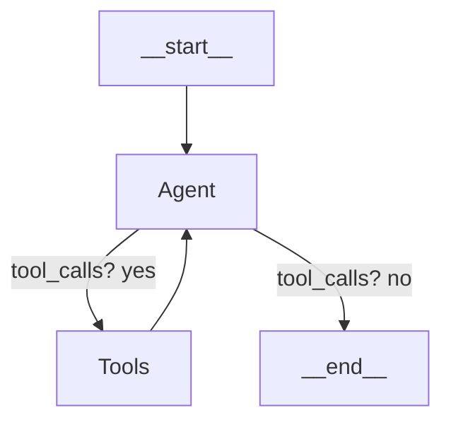

# Chat System Refactoring

This document outlines the changes made to the chat system architecture to align with LangGraph.js best practices. The refactoring resolves several key issues, including the `GraphRecursionError` and type-safety concerns.

## Previous Issues

1. **`GraphRecursionError` (limit 25 reached)**: The chat router would return itself, causing an infinite loop in the graph execution.
2. **Type safety errors**: Ad-hoc fields like `processed` were not part of the `OverallProposalState` interface.
3. **Monolithic router node**: Combined LLM reasoning, tool execution, and reply generation in one complex node.

## New Architecture

The refactored architecture follows the standard LangGraph pattern:



### Key Components

1. **Agent Node (`chatAgentNode`)**: An LLM node responsible for:
   - Processing user messages
   - Generating tool calls or final responses
   - Processing tool results and updating state

2. **Tools Node (`ToolNode`)**: A standard LangGraph `ToolNode` that:
   - Executes tool calls from the agent
   - Returns results to be processed by the agent

3. **Conditional Routing (`shouldContinueChat`)**: Routes based on presence of tool calls:
   - If tool calls present → "chatTools"
   - If no tool calls → "__end__" or downstream handler nodes

### State Management

The state now properly includes the `intent` field in `OverallProposalState`:

```typescript
interface UserIntent {
  command: UserCommand;
  targetSection?: string;
  details?: string;
}

type UserCommand =
  | "regenerate_section"
  | "modify_section"
  | "approve_section"
  | "ask_question"
  | "help"
  | "other";
```

The `OverallProposalStateAnnotation` defines the proper reducer for this field.

## Implementation Details

### InterpretIntentTool

Replaced the custom `StructuredTool` with the standard LangGraph tool pattern:

```typescript
export const interpretIntentTool = tool(
  async ({ userMessage }: { userMessage: string }) => {
    // Actual implementation handled by LLM
    return "ok";
  },
  {
    name: "interpret_intent",
    description: "Determine what action the user intends",
    schema: z.object({ userMessage: z.string() }),
    returnType: commandSchema,
  }
);
```

### ChatAgentNode

The agent node now handles two distinct cases:

1. **Human message processing**:
   ```typescript
   if (last instanceof HumanMessage) {
     const model = new ChatOpenAI({...}).bindTools([interpretIntentTool]);
     const response = await model.invoke(messages);
     return { messages: [response] };
   }
   ```

2. **Tool result processing**:
   ```typescript
   if (last instanceof ToolMessage) {
     const parsed: ParsedCommand = safeJSON(last.content);
     // Update state with intent
     return {
       messages: [replyMessage],
       intent: {
         command: parsed.command,
         targetSection: parsed.target_section,
         details: parsed.request_details,
       },
     };
   }
   ```

### Graph Construction

```typescript
const graph = new StateGraph(ProposalStateAnnotation)
  .addNode("agent", chatAgentNode)
  .addNode("tools", new ToolNode([interpretIntentTool]))
  .addEdge("__start__", "agent")
  .addConditionalEdges("agent", shouldContinueChat, {
    chatTools: "tools",
    regenerateSection: "regenerateSection",
    modifySection: "modifySection",
    __end__: "__end__"
  })
  .addEdge("tools", "agent");
```

## Orchestrator Updates

The OrchestratorService was updated to handle the new flow:

1. **Type-safe casting**: Ensuring invoke results are properly typed
2. **Intent-based processing**: Using `intent` field instead of the old `commandAction`
3. **API simplification**: Added `processChatMessage` method to handle user messages

## Benefits of the New Architecture

1. **No more recursion errors**: Clear start → agent → tools → agent → end flow
2. **Type safety**: Properly defined state fields with appropriate reducers
3. **Simplified code**: Each component has a single responsibility
4. **Maintainability**: Follows standard LangGraph patterns for easier updates
5. **Performance**: Reduced processing overhead and better state handling

## Migration Impact

This change should be transparent to end users. The chat interface behavior remains the same, but the underlying implementation is now more robust and aligns with LangGraph best practices.

## Future Improvements

1. **Streaming**: Implement token-by-token streaming for UI responsiveness
2. **Message summarization**: Add a reducer to cap chat history length
3. **Enhanced intent handling**: Expand the range of supported commands 